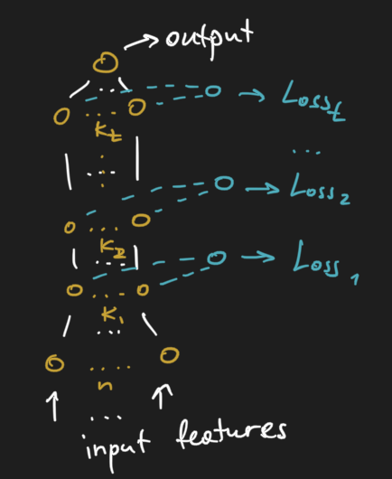

# Layer-wise loss

## Intuition
Train each layer/block of layers independently

## Example:
***for binary classification***

Details:
1. Train i - layer features(K_i) using Loss_i.
2. All other weights(K_j: j!=i) are fixed at that moment.
3. Temporary weights W_i in R^(K_i * 1) are all ones
and not trained during backprop.
